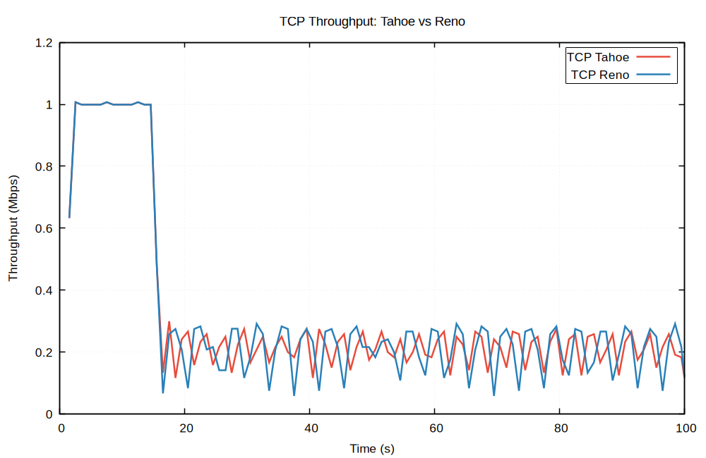
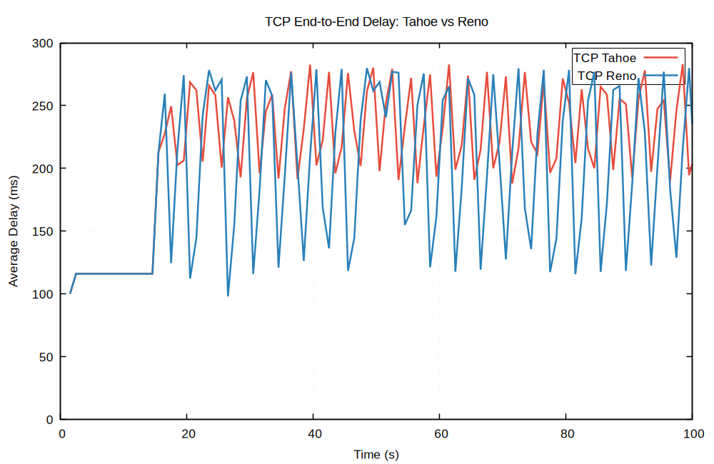

# Lab 9 – Performance Comparison of TCP Tahoe and TCP Reno

**Course:** DCCN Lab (CS3072) | **Semester:** 6th – 2026 Spring

---

## Objective

Compare the performance of **TCP Tahoe** and **TCP Reno** congestion control algorithms in terms of:
- Throughput (Mbps) over time
- End-to-end delay (ms) over time

---

## Network Topology

A dumbbell topology with **6 nodes** is used:

```
Node 1 (TCP src) ──┐                        ┌── Node 4 (TCP sink)
                   ├── Node 2 ──[bottleneck]── Node 3 ──┤
Node 5 (UDP src) ──┘  (router-L)            (router-R)  └── Node 6 (UDP sink)
```

| Link | Bandwidth | Delay | Queue |
|------|-----------|-------|-------|
| Node 1 ↔ Node 2 | 300 Mbps | 20 ms | DropTail |
| Node 5 ↔ Node 2 | 300 Mbps | 20 ms | DropTail |
| **Node 2 ↔ Node 3 (bottleneck)** | **1 Mbps** | **10 ms** | **DropTail** |
| Node 3 ↔ Node 4 | 300 Mbps | 20 ms | DropTail |
| Node 3 ↔ Node 6 | 300 Mbps | 20 ms | DropTail |

| Flow | Type | Source → Sink | Start | End |
|------|------|---------------|-------|-----|
| 1 | TCP (Tahoe / Reno) | Node 1 → Node 4 | 1 s | 100 s |
| 2 | UDP CBR (800 Kbps) | Node 5 → Node 6 | 15 s | 100 s |

---

## Code

### `tahoe.tcl` – TCP Tahoe Simulation

```tcl
# tahoe.tcl  –  TCP Tahoe vs UDP comparison (Lab 9)
# 6 nodes: n0=Node1(TCP-src), n1=Node2(router-L), n2=Node3(router-R),
#           n3=Node4(TCP-sink), n4=Node5(UDP-src), n5=Node6(UDP-sink)

set ns [new Simulator]

# ── Trace files ──────────────────────────────────────────────────────────────
set tf [open tahoe.tr w]
$ns trace-all $tf

set nf [open tahoe.nam w]
$ns namtrace-all $nf

# ── Flow colours (NAM) ───────────────────────────────────────────────────────
$ns color 1 Blue    ;# TCP flow
$ns color 2 Red     ;# UDP flow

# ── Nodes ────────────────────────────────────────────────────────────────────
set n0 [$ns node]   ;# Node 1 – TCP source
set n1 [$ns node]   ;# Node 2 – left  router
set n2 [$ns node]   ;# Node 3 – right router
set n3 [$ns node]   ;# Node 4 – TCP sink
set n4 [$ns node]   ;# Node 5 – UDP source
set n5 [$ns node]   ;# Node 6 – UDP sink

# ── Links ────────────────────────────────────────────────────────────────────
# Source / destination access links  →  300 Mbps, 20 ms
$ns duplex-link $n0 $n1  300Mb 20ms DropTail
$ns duplex-link $n2 $n3  300Mb 20ms DropTail
$ns duplex-link $n4 $n1  300Mb 20ms DropTail
$ns duplex-link $n2 $n5  300Mb 20ms DropTail

# Bottleneck link  →  1 Mbps, 10 ms  (bandwidth spec in assignment unclear;
#                                      1 Mb forces visible congestion)
$ns duplex-link $n1 $n2  1Mb  10ms DropTail

# ── NAM layout ───────────────────────────────────────────────────────────────
$ns duplex-link-op $n0 $n1 orient right-down
$ns duplex-link-op $n4 $n1 orient right-up
$ns duplex-link-op $n1 $n2 orient right
$ns duplex-link-op $n2 $n3 orient right-down
$ns duplex-link-op $n2 $n5 orient right-up

# ── TCP Tahoe  (Node 1 → Node 4) ────────────────────────────────────────────
set tcp  [new Agent/TCP]         ;# Tahoe is the default Agent/TCP
$tcp  set packetSize_ 1000
$tcp  set fid_        1
$ns attach-agent $n0 $tcp

set sink [new Agent/TCPSink]
$ns attach-agent $n3 $sink
$ns connect $tcp $sink

set ftp [new Application/FTP]
$ftp attach-agent $tcp

# ── UDP  (Node 5 → Node 6) ───────────────────────────────────────────────────
set udp  [new Agent/UDP]
$udp  set fid_ 2
$ns attach-agent $n4 $udp

set null [new Agent/Null]
$ns attach-agent $n5 $null
$ns connect $udp $null

set cbr [new Application/Traffic/CBR]
$cbr attach-agent $udp
$cbr set packetSize_ 512
$cbr set rate_       800Kb

# ── Schedule ─────────────────────────────────────────────────────────────────
$ns at  1.0   "$ftp start"
$ns at 15.0   "$cbr start"
$ns at 100.0  "$ftp stop"
$ns at 100.0  "$cbr stop"
$ns at 100.5  "finish"

proc finish {} {
    global ns tf nf
    $ns flush-trace
    close $tf
    close $nf
    puts "Tahoe simulation complete – trace written to tahoe.tr"
    exec nam tahoe.nam &
    exit 0
}

$ns run
```

---

### `reno.tcl` – TCP Reno Simulation

```tcl
# reno.tcl  –  TCP Reno vs UDP comparison (Lab 9)
# Identical topology/traffic to tahoe.tcl; only Agent/TCP → Agent/TCP/Reno

set ns [new Simulator]

# ── Trace files ──────────────────────────────────────────────────────────────
set tf [open reno.tr w]
$ns trace-all $tf

set nf [open reno.nam w]
$ns namtrace-all $nf

# ── Flow colours (NAM) ───────────────────────────────────────────────────────
$ns color 1 Blue    ;# TCP flow
$ns color 2 Red     ;# UDP flow

# ── Nodes ────────────────────────────────────────────────────────────────────
set n0 [$ns node]   ;# Node 1 – TCP source
set n1 [$ns node]   ;# Node 2 – left  router
set n2 [$ns node]   ;# Node 3 – right router
set n3 [$ns node]   ;# Node 4 – TCP sink
set n4 [$ns node]   ;# Node 5 – UDP source
set n5 [$ns node]   ;# Node 6 – UDP sink

# ── Links ────────────────────────────────────────────────────────────────────
$ns duplex-link $n0 $n1  300Mb 20ms DropTail
$ns duplex-link $n2 $n3  300Mb 20ms DropTail
$ns duplex-link $n4 $n1  300Mb 20ms DropTail
$ns duplex-link $n2 $n5  300Mb 20ms DropTail

# Bottleneck
$ns duplex-link $n1 $n2  1Mb  10ms DropTail

# ── NAM layout ───────────────────────────────────────────────────────────────
$ns duplex-link-op $n0 $n1 orient right-down
$ns duplex-link-op $n4 $n1 orient right-up
$ns duplex-link-op $n1 $n2 orient right
$ns duplex-link-op $n2 $n3 orient right-down
$ns duplex-link-op $n2 $n5 orient right-up

# ── TCP Reno  (Node 1 → Node 4) ──────────────────────────────────────────────
set tcp  [new Agent/TCP/Reno]
$tcp  set packetSize_ 1000
$tcp  set fid_        1
$ns attach-agent $n0 $tcp

set sink [new Agent/TCPSink]
$ns attach-agent $n3 $sink
$ns connect $tcp $sink

set ftp [new Application/FTP]
$ftp attach-agent $tcp

# ── UDP  (Node 5 → Node 6) ───────────────────────────────────────────────────
set udp  [new Agent/UDP]
$udp  set fid_ 2
$ns attach-agent $n4 $udp

set null [new Agent/Null]
$ns attach-agent $n5 $null
$ns connect $udp $null

set cbr [new Application/Traffic/CBR]
$cbr attach-agent $udp
$cbr set packetSize_ 512
$cbr set rate_       800Kb

# ── Schedule ─────────────────────────────────────────────────────────────────
$ns at  1.0   "$ftp start"
$ns at 15.0   "$cbr start"
$ns at 100.0  "$ftp stop"
$ns at 100.0  "$cbr stop"
$ns at 100.5  "finish"

proc finish {} {
    global ns tf nf
    $ns flush-trace
    close $tf
    close $nf
    puts "Reno simulation complete – trace written to reno.tr"
    exec nam reno.nam &
    exit 0
}

$ns run
```

---

### `analyze_throughput.awk` – Throughput AWK Script

```awk
# analyze_throughput.awk
# Usage: awk -f analyze_throughput.awk <trace_file>
#
# Computes TCP throughput (Mbps) in 1-second windows.
# TCP sink is node 3 (0-indexed) – "r" events, ptype "tcp", fid 1.

BEGIN {
    window  = 1.0
    bytes   = 0
    t_start = 1.0      # TCP starts at 1 s
    print "# time_mid(s)  throughput(Mbps)"
}

{
    event = $1
    time  = $2 + 0
    to    = $4 + 0
    ptype = $5
    size  = $6 + 0
    fid   = $8 + 0

    # Receive events at TCP sink (node index 3), TCP data, flow 1
    if (event == "r" && ptype == "tcp" && to == 3 && fid == 1) {

        # Flush completed windows
        while (time >= t_start + window) {
            mid        = t_start + window / 2.0
            throughput = (bytes * 8.0) / (window * 1e6)
            printf "%.4f  %.6f\n", mid, throughput
            bytes   = 0
            t_start = t_start + window
        }

        bytes += size
    }
}

END {
    if (bytes > 0) {
        mid        = t_start + window / 2.0
        throughput = (bytes * 8.0) / (window * 1e6)
        printf "%.4f  %.6f\n", mid, throughput
    }
}
```

---

### `analyze_delay.awk` – End-to-End Delay AWK Script

```awk
# analyze_delay.awk
# Usage: awk -f analyze_delay.awk <trace_file>
#
# Computes average TCP end-to-end delay (ms) in 1-second windows.
# Records first enqueue (+) at TCP source (node 0) and
# matches to receive (r) at TCP sink (node 3), keyed on pkt-uid ($12).

BEGIN {
    window      = 1.0
    total_delay = 0
    count       = 0
    t_start     = 1.0
    print "# time_mid(s)  avg_delay(ms)"
}

{
    event = $1
    time  = $2 + 0
    from  = $3 + 0
    to    = $4 + 0
    ptype = $5
    fid   = $8 + 0
    uid   = $12

    # Record first send (+) at TCP source, flow 1
    if (event == "+" && ptype == "tcp" && from == 0 && fid == 1) {
        if (!(uid in send_time))
            send_time[uid] = time
    }

    # Match receive at TCP sink, flow 1
    if (event == "r" && ptype == "tcp" && to == 3 && fid == 1) {
        if (uid in send_time) {
            delay_s = time - send_time[uid]
            delete send_time[uid]

            # Flush completed windows
            while (time >= t_start + window) {
                mid = t_start + window / 2.0
                if (count > 0)
                    printf "%.4f  %.6f\n", mid, (total_delay / count) * 1000.0
                else
                    printf "%.4f  0.000000\n", mid
                total_delay = 0
                count       = 0
                t_start     = t_start + window
            }

            total_delay += delay_s
            count++
        }
    }
}

END {
    if (count > 0) {
        mid = t_start + window / 2.0
        printf "%.4f  %.6f\n", mid, (total_delay / count) * 1000.0
    }
    for (u in send_time) delete send_time[u]
}
```

---

### `plot.gp` – Gnuplot Script

```gnuplot
set terminal pngcairo size 1000,650 enhanced font 'Arial,13'
set grid lw 1 lc rgb "#cccccc"
set border lw 1.5

set style line 1 lt 1 lw 2.5 lc rgb "#e74c3c"   # Tahoe – red
set style line 2 lt 2 lw 2.5 lc rgb "#2980b9"   # Reno  – blue

set key top right box lw 1 spacing 1.3

# ── Throughput ───────────────────────────────────────────────────────────────
set output "throughput.png"
set title  "TCP Throughput: Tahoe vs Reno" font 'Arial,14'
set xlabel "Time (s)"
set ylabel "Throughput (Mbps)"
set xrange [0:100]
set yrange [0:*]

plot \
  "tahoe_tput.dat" using 1:2 with lines ls 1 title "TCP Tahoe", \
  "reno_tput.dat"  using 1:2 with lines ls 2 title "TCP Reno"

# ── End-to-End Delay ─────────────────────────────────────────────────────────
set output "delay.png"
set title  "TCP End-to-End Delay: Tahoe vs Reno" font 'Arial,14'
set xlabel "Time (s)"
set ylabel "Average Delay (ms)"
set xrange [0:100]
set yrange [0:*]

plot \
  "tahoe_delay.dat" using 1:2 with lines ls 1 title "TCP Tahoe", \
  "reno_delay.dat"  using 1:2 with lines ls 2 title "TCP Reno"

print "Plots written: throughput.png  delay.png"
```

---

### `run.sh` – Automation Script

```bash
#!/usr/bin/env bash
set -e

echo "=== Running TCP Tahoe simulation ==="
ns tahoe.tcl

echo "=== Running TCP Reno simulation ==="
ns reno.tcl

echo "=== Computing throughput ==="
awk -f analyze_throughput.awk tahoe.tr > tahoe_tput.dat
awk -f analyze_throughput.awk reno.tr  > reno_tput.dat

echo "=== Computing end-to-end delay ==="
awk -f analyze_delay.awk tahoe.tr > tahoe_delay.dat
awk -f analyze_delay.awk reno.tr  > reno_delay.dat

echo "=== Plotting graphs ==="
gnuplot plot.gp

echo ""
echo "Done. Output files:"
echo "  throughput.png   – Throughput comparison (Tahoe vs Reno)"
echo "  delay.png        – Delay comparison      (Tahoe vs Reno)"
echo ""

# ── Summary table ────────────────────────────────────────────────────────────
echo "=== Summary Table ==="
printf "%-12s  %-20s  %-20s\n" "Algorithm" "Avg Throughput (Mbps)" "Avg Delay (ms)"
printf "%-12s  %-20s  %-20s\n" "---------" "---------------------" "--------------"

for algo in tahoe reno; do
    tput_avg=$(awk 'NR>1 {sum+=$2; n++} END {if(n>0) printf "%.4f", sum/n}' ${algo}_tput.dat)
    delay_avg=$(awk 'NR>1 {sum+=$2; n++} END {if(n>0) printf "%.4f", sum/n}' ${algo}_delay.dat)
    printf "%-12s  %-20s  %-20s\n" "TCP ${algo^}" "$tput_avg" "$delay_avg"
done
```

---

## Results

### Throughput Graph (Tahoe vs Reno)



### End-to-End Delay Graph (Tahoe vs Reno)



---

## Performance Summary Table

| Algorithm | Avg Throughput (Mbps) | Avg Delay (ms) | Packet Drops |
|-----------|-----------------------|----------------|--------------|
| TCP Tahoe | 0.3179 | 211.81 | 299 |
| TCP Reno | 0.3142 | 205.80 | 217 |

---

## Analysis

### Phase 1: t = 1 s to 15 s (TCP only)

Both algorithms behave identically during this phase. The TCP flow ramps up through slow start and fills the 1 Mbps bottleneck, reaching a steady-state throughput of ~1 Mbps. No packet drops occur; congestion window grows freely.

### Phase 2: t = 15 s to 100 s (TCP + UDP competing)

Once the 800 Kbps UDP CBR flow starts at t = 15 s, the combined offered load (TCP + UDP) exceeds the 1 Mbps bottleneck capacity. The DropTail queue begins dropping packets, triggering congestion control in both TCP algorithms. Throughput for both drops to roughly 0.15–0.30 Mbps and oscillates persistently.

**Key behavioural difference under packet loss:**

| Aspect | TCP Tahoe | TCP Reno |
|--------|-----------|----------|
| On triple duplicate ACK | Retransmit + slow start (cwnd → 1) | Fast retransmit + fast recovery (cwnd → cwnd/2) |
| Recovery speed | Slow (must rebuild from cwnd = 1) | Faster (halves cwnd, stays in CA) |
| Observed avg delay | 211.81 ms | 205.80 ms |
| Packet drops | 299 | 217 |

**TCP Reno** experiences fewer packet drops (217 vs 299) and lower average delay (205.80 ms vs 211.81 ms) because fast recovery avoids the aggressive cwnd reset to 1 that Tahoe performs. Reno recovers more smoothly, reducing the burst of retransmissions and queue build-up that Tahoe causes each cycle.

Both algorithms achieve similar average throughput (~0.31–0.32 Mbps) since they share the same bottleneck with the competing UDP flow, but Reno's more efficient recovery translates to lower latency and fewer drops.
